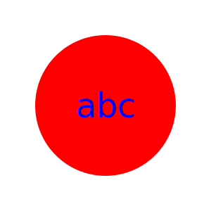
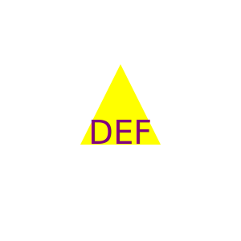
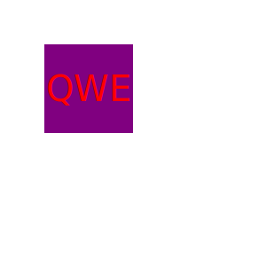
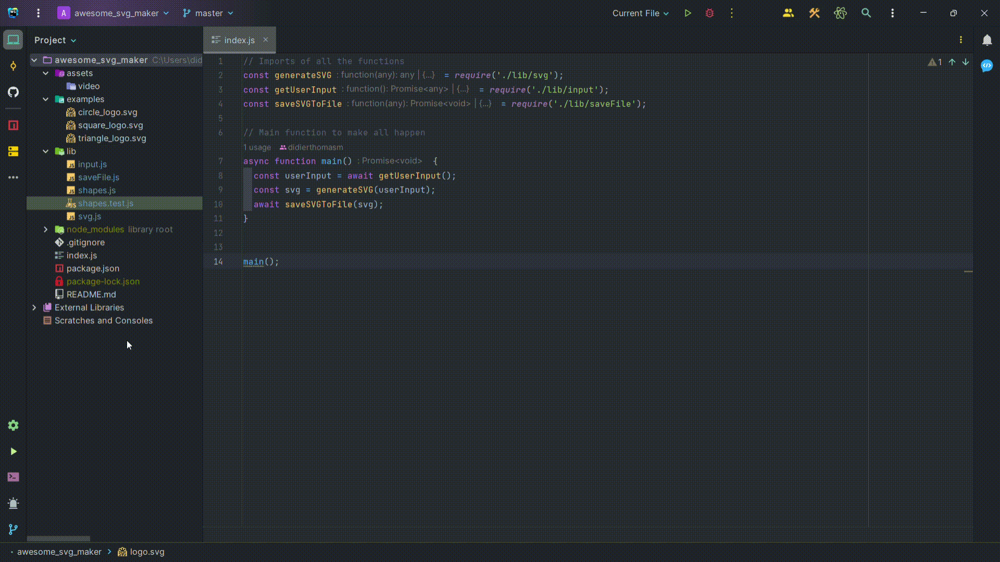

# Awesome SVG Logo Maker

Generate simple logos for your projects using this Node.js command-line application. 
Say goodbye to paying graphic designers and create logos with ease!

## Table of Contents

- [Introduction](#introduction)
- [Features](#features)
- [Installation](#installation)
- [Usage](#usage)
- [Examples](#examples)
- [Questions](#questions)
- [Walkthrough Video](#walkthrough-video)
- [Technologies](#technologies)
- [Contributing](#contributing)
- [License](#license)

## Introduction

As a freelance web developer, you often need logos for your projects. With the **Awesome SVG Logo Maker**, you can create logos quickly and easily using a command-line interface. Choose your text, colors, and shape, and the application will generate an SVG logo that matches your criteria.

## Features

- Choose up to three characters for the logo text.
- Select colors for both the text and shape using keywords or hex values.
- Pick from a variety of shapes: circle, triangle, and square.
- Automatically generates an SVG logo file.
- Provides instant feedback on the generated logo.

## Installation

1. Clone the repository:

   ```sh
   git clone https://github.com/your-username/awesome-svg-logo-maker.git
   cd awesome-svg-logo-maker
   
2. Install dependencies:

    ```sh
   npm install

## Usage

1. Run the application:
    ```sh
   node index.js
   
2. Follow the prompts to enter text, text color, shape, and shape color.

3. Once you've completed all prompts, an SVG logo file named `logo.svg` will be generated in the project directory.

## Examples

Here are a few examples of SVG logos generated using the Awesome SVG Logo Maker:

- 
- 
- 

## Questions

If you have any questions or need further assistance, feel free to reach out:

- GitHub: [Your GitHub Username](https://github.com/didierthomasm)
- Email: didierthomas.m@gmail.com
- 
## Walkthrough Video

For a detailed walkthrough of how to use the Awesome SVG Logo Maker, 
check out our [Walkthrough Video](./assets/video/awesome_svg_maker.gif).


The video covers:

- Invoking the application from the command line.
- Entering responses to all prompts.
- Generating an SVG file and opening it in a browser.

## Technologies

This project is built using the following technologies:

- Node.js
- Inquirer package for user input
- Jest package for unit tests

## Contributing

Contributions are welcome! 
If you find a bug or want to improve the application, please open an issue or submit a pull request.

## License

This project is licensed under the [MIT License](https://opensource.org/licenses/MIT).
